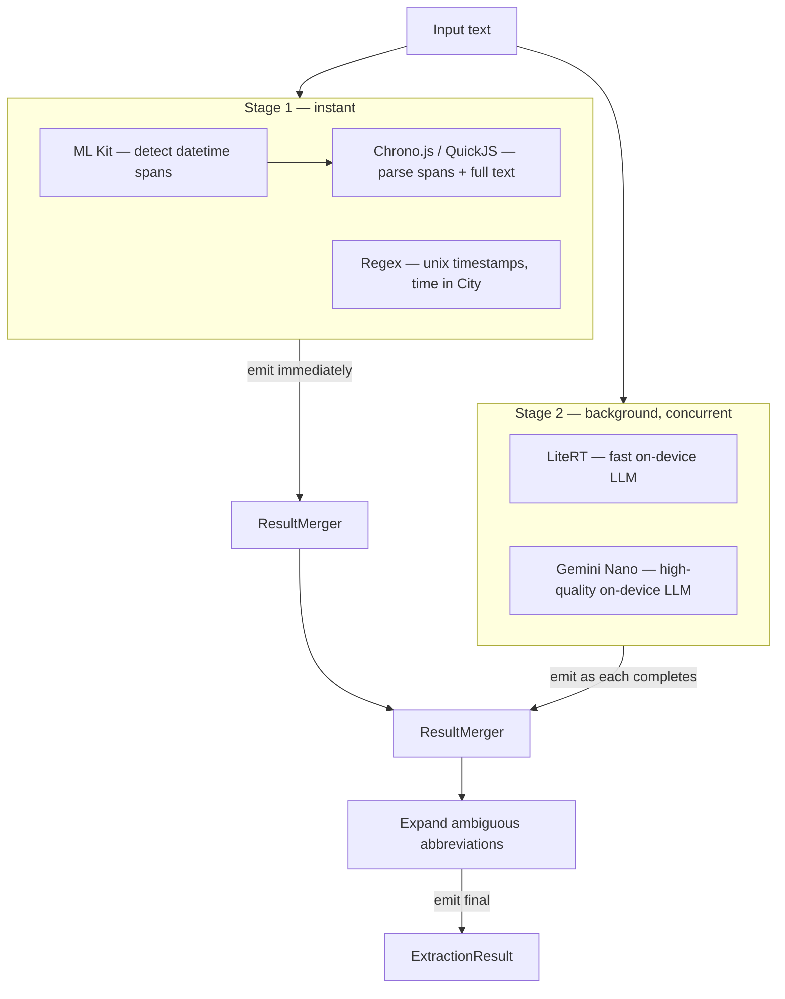
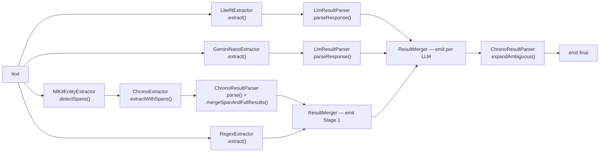

# NLP Pipeline

ChronoShift extracts timestamps from arbitrary text using a tiered, streaming pipeline. Results appear as each stage completes — the user sees fast results immediately, with LLM-quality results merging in seconds later.

## Overview

## Orchestration

`TieredTimeExtractor` orchestrates the pipeline. It implements `StreamingTimeExtractor`, exposing a `Flow<ExtractionResult>` that emits incrementally as stages complete.

### Stage 1: Fast Extractors

Three extractors run concurrently:

1. **ML Kit span detection** (`MlKitEntityExtractor` / `SpanDetector`) — identifies datetime-like spans in the input text. These spans are fed to Chrono for focused parsing, which improves accuracy over raw full-text parsing.

2. **Chrono.js** (`ChronoExtractor` / `SpanAwareTimeExtractor`) — a JavaScript NLP datetime parser running in QuickJS via Zipline. When ML Kit provides spans, Chrono parses each span individually, then also parses the full text to capture context like timezones that isolated spans miss. `ChronoResultParser.mergeSpanAndFullResults()` combines the two.

3. **Regex** (`RegexExtractor`) — handles unix timestamps (e.g. `1700000000`) and "time in City" patterns. Delegates city-to-timezone resolution to `CityResolver`.

ML Kit and Chrono run as a coordinated pair (spans feed into Chrono). Regex runs independently. All three complete near-instantly and results are merged and emitted.

### Stage 2: On-Device LLMs

Two LLM extractors run concurrently. Whichever finishes first emits an intermediate result, and the second merges in when done:

1. **LiteRT** (`LiteRtExtractor`) — runs a Gemma model via Google LiteRT-LM. Faster of the two. Model must be downloaded separately via Settings.

2. **Gemini Nano** (`GeminiNanoExtractor`) — uses the on-device Gemini model via ML Kit GenAI. Higher quality but slower. Availability depends on device support.

Both LLMs receive a structured prompt asking for JSON output with time, date, timezone, and original text fields. `LlmResultParser` handles response parsing for both.

### Final Step: Ambiguity Expansion

After all stages complete, `ChronoResultParser.expandAmbiguous()` expands timezone abbreviations that map to multiple zones (e.g., "CST" → US Central + China Standard) into separate results.

## Interfaces

| Interface | Purpose | Implementors |
|---|---|---|
| `TimeExtractor` | Basic `extract(text): ExtractionResult` | All extractors, `TieredTimeExtractor` |
| `SpanAwareTimeExtractor` | Adds `extractWithSpans(text, spans)` | `ChronoExtractor` |
| `SpanDetector` | `detectSpans(text): List<DateTimeSpan>` | `MlKitEntityExtractor` |
| `StreamingTimeExtractor` | `extractStream(text): Flow<ExtractionResult>` | `TieredTimeExtractor` |

## Data Flow

## Key Design Decisions

- **ML Kit is a spotter, not a parser.** It detects datetime spans but has no timezone awareness. Chrono does the actual parsing.
- **Span + full-text dual parse.** Chrono parses each ML Kit span individually (for precision) and the full text (for timezone context). The merge step upgrades span results with timezone info from the full-text parse.
- **LLMs race, first wins.** LiteRT and Gemini Nano run concurrently. The first to finish emits immediately so the user doesn't wait for the slower one.
- **Timezone from offsets, not names.** Chrono returns timezone as minute offsets. `ChronoResultParser.offsetToTimezone()` finds a matching IANA zone at the parsed instant — this means the same offset can map to different zones depending on DST.
