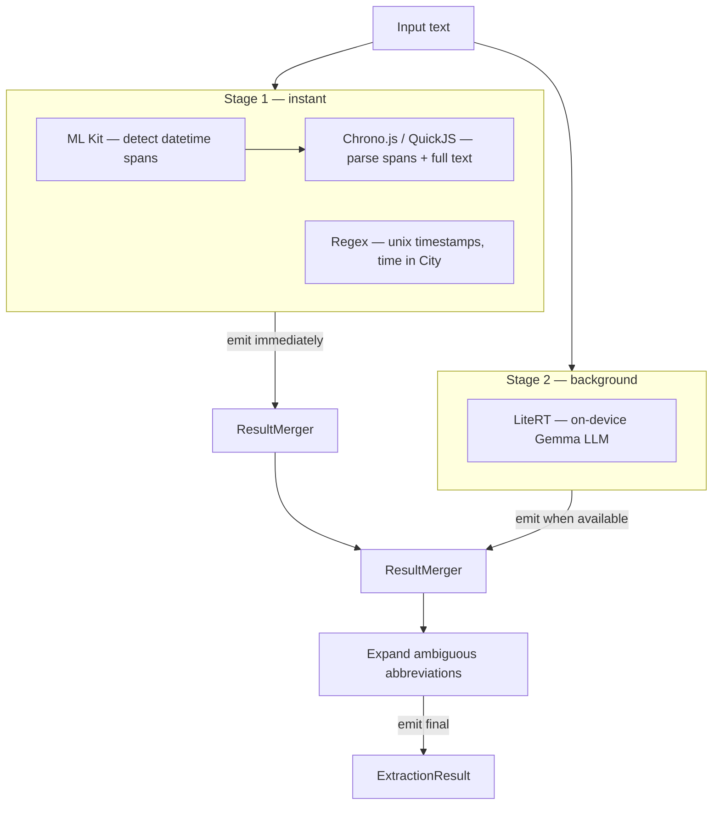
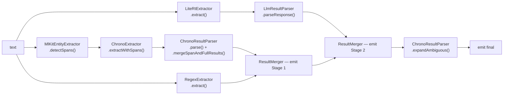

# NLP Pipeline

ChronoShift extracts timestamps from arbitrary text using a tiered, streaming pipeline. Fast results appear immediately, with LiteRT/Gemma results merging in later when the optional on-device model is installed.

## Overview

```mermaid
flowchart TD
    input[Input text]

    subgraph stage1[Stage 1 — instant]
        mlkit[ML Kit — detect datetime spans]
        chrono[Chrono.js / QuickJS — parse spans + full text]
        regex[Regex — unix timestamps, time in City]
        mlkit --> chrono
    end

    subgraph stage2[Stage 2 — background]
        litert[LiteRT — on-device Gemma LLM]
    end

    expand[Expand ambiguous abbreviations]

    input --> stage1
    input --> stage2
    stage1 -- emit immediately --> merge1[ResultMerger]
    stage2 -- emit when available --> merge2[ResultMerger]
    merge1 --> merge2
    merge2 --> expand
    expand -- emit final --> results[ExtractionResult]
```

## Orchestration

`TieredTimeExtractor` orchestrates the pipeline. It implements `StreamingTimeExtractor`, exposing a `Flow<ExtractionResult>` that emits incrementally as stages complete.

### Stage 1: Fast Extractors

Three extractors run concurrently:

1. **ML Kit span detection** (`MlKitEntityExtractor` / `SpanDetector`) — identifies datetime-like spans in the input text. These spans are fed to Chrono for focused parsing, which improves accuracy over raw full-text parsing.

2. **Chrono.js** (`ChronoExtractor` / `SpanAwareTimeExtractor`) — a JavaScript NLP datetime parser running in QuickJS via Zipline. When ML Kit provides spans, Chrono parses each span individually, then also parses the full text to capture context like timezones that isolated spans miss. `ChronoResultParser.mergeSpanAndFullResults()` combines the two.

3. **Regex** (`RegexExtractor`) — handles unix timestamps (e.g. `1700000000`) and "time in City" patterns. Delegates city-to-timezone resolution to `CityResolver`.

ML Kit and Chrono run as a coordinated pair (spans feed into Chrono). Regex runs independently. All three complete near-instantly and results are merged and emitted.

### Stage 2: On-Device LLM

**LiteRT** (`LiteRtExtractor`) runs a Gemma model via Google LiteRT-LM. The model must be downloaded separately via Settings. It receives a structured prompt asking for JSON output with time, date, timezone, and original text fields. `LlmResultParser` parses the response.

If no LiteRT model is installed, Stage 1 results remain the final results.

### Final Step: Ambiguity Expansion

After all stages complete, `ChronoResultParser.expandAmbiguous()` expands timezone abbreviations that map to multiple zones (e.g., "CST" → US Central + China Standard) into separate results.

## Interfaces

| Interface | Purpose | Implementors |
|---|---|---|
| `TimeExtractor` | Basic `extract(text): ExtractionResult` | All extractors, `TieredTimeExtractor` |
| `SpanAwareTimeExtractor` | Adds `extractWithSpans(text, spans)` | `ChronoExtractor` |
| `SpanDetector` | `detectSpans(text): List<DateTimeSpan>` | `MlKitEntityExtractor` |
| `StreamingTimeExtractor` | `extractStream(text): Flow<ExtractionResult>` | `TieredTimeExtractor` |

## Data Flow

```mermaid
flowchart LR
    text[text]

    text --> mlkit["MlKitEntityExtractor\n.detectSpans()"]
    mlkit --> chrono["ChronoExtractor\n.extractWithSpans()"]
    chrono --> chronoparse["ChronoResultParser\n.parse() + .mergeSpanAndFullResults()"]

    text --> regex["RegexExtractor\n.extract()"]

    chronoparse --> merge1["ResultMerger — emit Stage 1"]
    regex --> merge1

    text --> litert["LiteRtExtractor\n.extract()"]
    litert --> llmparse["LlmResultParser\n.parseResponse()"]
    llmparse --> merge2["ResultMerger — emit Stage 2"]
    merge1 --> merge2

    merge2 --> expand["ChronoResultParser\n.expandAmbiguous()"]
    expand --> final[emit final]
```

## Key Design Decisions

- **ML Kit is a spotter, not a parser.** It detects datetime spans but has no timezone awareness. Chrono does the actual parsing.
- **Span + full-text dual parse.** Chrono parses each ML Kit span individually (for precision) and the full text (for timezone context). The merge step upgrades span results with timezone info from the full-text parse.
- **LiteRT is optional.** The app keeps working on devices without a downloaded model; when present, the Gemma model adds background LLM-quality results.
- **Timezone from offsets, not names.** Chrono returns timezone as minute offsets. `ChronoResultParser.offsetToTimezone()` finds a matching IANA zone at the parsed instant, which means the same offset can map to different zones depending on DST.
