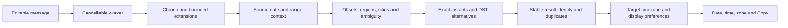

# Web conversion pipeline

ChronoShift parses messages locally in a disposable browser worker. The launch path uses pinned Chrono and bundled Temporal, without a model download or conversion service.

```mermaid
flowchart LR
    input[Editable message] --> worker[Cancellable worker]
    worker --> parse[Chrono and bounded extensions]
    parse --> context[Source date and range context]
    context --> zones[Offsets, regions, cities and ambiguity]
    zones --> temporal[Exact instants and DST alternatives]
    temporal --> merge[Stable result identity and duplicates]
    merge --> format[Target timezone and display preferences]
    format --> results[Date, time, zone and Copy]
```

## Parsing and source context

`engine/parser.ts` clones the pinned English Chrono parsers for month/day and day/month conventions. Bounded extensions handle military hours, shorthand meridiem and between-ranges. `convert.ts` receives the reference instant, default source zone, target zone and numeric-date order explicitly.

The reference day is resolved in the source zone. Date context may apply within a sentence/list and resets across unrelated text. Ranges retain endpoint order and overnight dates. Dates without times remain dates. Unix seconds use a bounded supported interval.

## Timezone interpretation

Explicit offsets and standard/daylight abbreviations remain fixed offsets. Regional PT/ET/CT/MT and IANA zones use event-date DST rules. Supported ambiguous abbreviations retain all labeled alternatives. Curated offline city aliases and unique bounded typo matches need no geocoder.

Temporal returns both valid instants for a repeated DST local time and a warning for a nonexistent local time. Unknown zones/cities and unsupported vague expressions require correction rather than an invented answer. See [the product contract](../planning/web-product-contract.md) for exact independent examples.

## Merge and display

Results keep their source identity, date and range endpoint. Duplicate mentions increment occurrences; an explicit source can replace an equivalent assumed source. Target changes only reformat existing results. Display and copying preserve the full date, offset/zone, seconds and milliseconds when supplied. [Merge rules](merge-philosophy.md) explain the boundaries.

## Request lifecycle and privacy

`App.tsx` creates a disposable worker for each conversion. Request IDs and invalidation prevent late results from replacing edited/cleared input. Errors retain editable text. Conversion text stays in memory; only preferences persist by default. A supported POST share or explicit update uses a short-lived, single-use local handoff.

The build bundles UI/parser/polyfill/worker/CSS/icons/notices on the same origin. Atomic service-worker preparation confirms all required assets before reporting Offline ready. New versions wait for explicit activation; partial installations retain the working cache.

Optional learned span detection is a separate research/benchmark ticket. It must justify its browser size, latency and accuracy before enhancing the deterministic path. See [ML research](../planning/lightweight-browser-ml-research.md).
