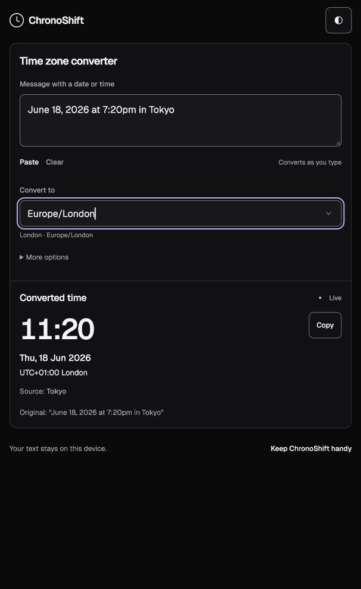

# Live conversion motion — delivery evidence

User request: add clean, restrained movement so live conversion is apparent; complete this animation work first. [TIE-372](https://linear.app/tienlam/issue/TIE-372/make-live-conversion-visible-with-restrained-accessible-motion) is delivered by [PR 35](https://github.com/Tien-Lam/ChronoShift/pull/35), published at [ChronoShift](https://tien-lam.github.io/ChronoShift/).

The page responds immediately with Updating during debounce and worker activity, then Live. IME composition shows Paused and validation errors show Check input. Brief result reveals, surface fades, chevron motion and standalone button feedback add movement without continuous idle animation. Reduced-motion preferences retain static state feedback. No dependency, conversion backend or runtime network assets were added.

Research: [Geist loading dots](https://vercel.com/geist/loading-dots), [Carbon motion](https://www.carbondesignsystem.com/building-blocks/foundations/motion/overview) and [MDN prefers-reduced-motion](https://developer.mozilla.org/en-US/docs/Web/CSS/Reference/At-rules/@media/prefers-reduced-motion). These inform background-work feedback, short productive transitions and reduced-motion support. The original request, dispatch scope, research and invariants are in [brief.md](brief.md).

## Revisions and gate

- Base: `12b9a7f9bf924472c89c9d33aa28ca14fb482365`.
- Initial candidate: `9a4250219442d9217a903109448a1db0529f37ac`.
- Final reviewed head: `0f7812fc2e59d9adb1d5c7f6eac92ca23240a2f8`.
- CI-tested release source: `8efda34526ff8765e254ec20d3c08f385fb7a911`.
- Main runtime merge: `1114a717f2d1c2b97d4ddf7200a18984ab70bcb1`.
- Final head, tested source and runtime merge share exact tree `9f6d5607ae14cbfc21c263b3bad14c70985f7a78`.

[Final CI](https://github.com/Tien-Lam/ChronoShift/actions/runs/37264918019) passed typecheck, formatting, 116 unit tests, build, corpus audit, **242 browser checks on their first attempt**, six documented CDP-only skips and one repository-subpath check. Raw output: [ci-final.log](ci-final.log). Root's targeted five-profile controls/motion run passed 25 checks without retries in 35.4 seconds: [root-fixed-tests.log](root-fixed-tests.log). Earlier 20-check live/motion validation is retained in [root-tests.log](root-tests.log).

## Original failure, review gap and correction

The first independent reviews approved their bounded checks, but the [initial full CI](https://github.com/Tien-Lam/ChronoShift/actions/runs/37232150098) found two failures: the existing timezone journey resized an open full-list menu to 280px, closed/reopened it, then selected Tokyo by pointer. Chromium intermittently closed without canonical selection; Firefox intercepted the pointer and detached the option. The complete original output and failure screenshots/error contexts/retry traces remain in [ci-first.log](ci-first.log) and `initial-failures/`. Root reproduced the matching Firefox failure in [repro.log](repro.log).

Moving geometry-owning controls and outer popovers during interaction caused the regression. The final CSS leaves the workspace, anchored controls and outer positioned overlays stationary, uses opacity fades on those surfaces, and keeps translations on standalone actions and result content. Existing control expectations were unchanged: no force clicks, added selection sleeps or weakened assertions.

Initial review covered settled geometry and narrower interaction paths; it did not establish correctness for this full-list resize/reopen/pointer journey during motion. The updated [review workflow](../../developer/review.md) now requires immediate normal-motion interaction on geometry owners, open-menu resize and close/reopen coverage. Candidate reviewers independently followed the matching journey; one also ran repeated Chromium/Firefox checks and early open-menu/calendar interactions. Exact tested conditions, timings and limits remain in their separate reports.

| Review stage            | Code review                             | Adversarial review                                     |
| ----------------------- | --------------------------------------- | ------------------------------------------------------ |
| Initial scope           | [Original](code-initial.md)             | [Original, timing correction](adversarial-original.md) |
| Failed CI investigation | [Original failure](code-ci-original.md) | [Original failure](adversarial-ci-original.md)         |
| Final candidate         | [Delta approval](code-delta.md)         | [Delta approval](adversarial-delta.md)                 |

Both final candidate reports approve their bounded implementation scope with no blockers. Matching Firefox original failure was independently reproduced and prevented on the candidate. The intermittent Chromium original failure is retained in CI evidence; final full CI supplies the first-attempt acceptance gate. This is not an exhaustive timing or physical-device claim. [ci-brief.md](ci-brief.md) records the saved failure scope and honest dispatch chronology. The adversarial initial report as posted remains separately preserved in [adversarial-as-posted.md](adversarial-as-posted.md); its timing correction does not replace the original content or verdict. Raw diagnostic text retains original whitespace.

## Publication and hosted browser acceptance

[Pages run](https://github.com/Tien-Lam/ChronoShift/actions/runs/37265470250) successfully published main using the trusted successful PR artifact with digest and exact source-tree verification. Raw output: [pages-final.log](pages-final.log).

The independent [publication audit](code-publication.md) passed **64 checks**: trusted workflow/gate identity, safe archive inventories, GitHub archive digests, identical extracted files and exact public hashes/lengths for all **14 deployed files plus the root URL**. Detailed command timings, identities and results are in [code/publication-audit.json](code/publication-audit.json). Its audited main identity is the runtime merge above; a later documentation-only commit does not alter the deployed runtime.

Root's hosted gate passed **four checks in 28.1 seconds** on installed Google Chrome desktop and Pixel emulation. It exercised 21 seconds of idle use without the offline warning, fresh conversion after offline close/reopen, scoped manifest, identifiable release and effective static CSP: [hosted-gate.log](hosted-gate.log). Command:

```sh
HOSTED_EXPECTED_COMMIT=8efda34526ff8765e254ec20d3c08f385fb7a911 PLAYWRIGHT_CHROMIUM_CHANNEL=chrome PLAYWRIGHT_HTML_OUTPUT_DIR=/tmp/chronoshift-motion-hosted-html mise exec -- bun run test:hosted --output=/tmp/chronoshift-motion-hosted
```

Actual in-app browser evidence at the public URL used its natural **606×988** viewport, with synthetic input only. The cached client was explicitly updated via Update now; its draft and automatic result survived ([before](hosted-before.json), [restored](hosted-restored.json)). Editing Tokyo 6:20pm to 7:20pm visibly produced Updating with active dot pulses and zero Copy controls ([pending](hosted-pending.json), [accessibility snapshot](hosted-pending.txt)), then Live with London 11:20. Normal pointer selection of London canonicalized the target to Europe/London and recomputed. The final [DOM record](published-side-panel.json) identifies the published script `assets/index-C_14_jcq.js`, ready indicator, input, target and result; [screenshot](published-side-panel.png) shows the settled page. Local preview evidence is retained separately in [preview-side-panel.json](preview-side-panel.json) and [screenshot](preview-side-panel.png).



## Limits and documentation follow-up

Physical phones/folding, real keyboard/IME, screen readers, browser/OS zoom and human motion-preference acceptance remain separate open project gaps. This feature ticket does not close those tickets or TIE-370's older-worker CI investigation. The original Chromium intermittent failure was not independently reproduced locally; CI failure and first-attempt candidate success are retained explicitly.

The review-workflow improvement and browser-count correction have independent [final documentation approval](code-doc-final.md), supplementing [guidance review](code-doc-guidance.md). This evidence record, planning snapshot and those documentation changes are saved in a subsequent documentation-only main commit; they need no runtime rebuild or redeployment.
